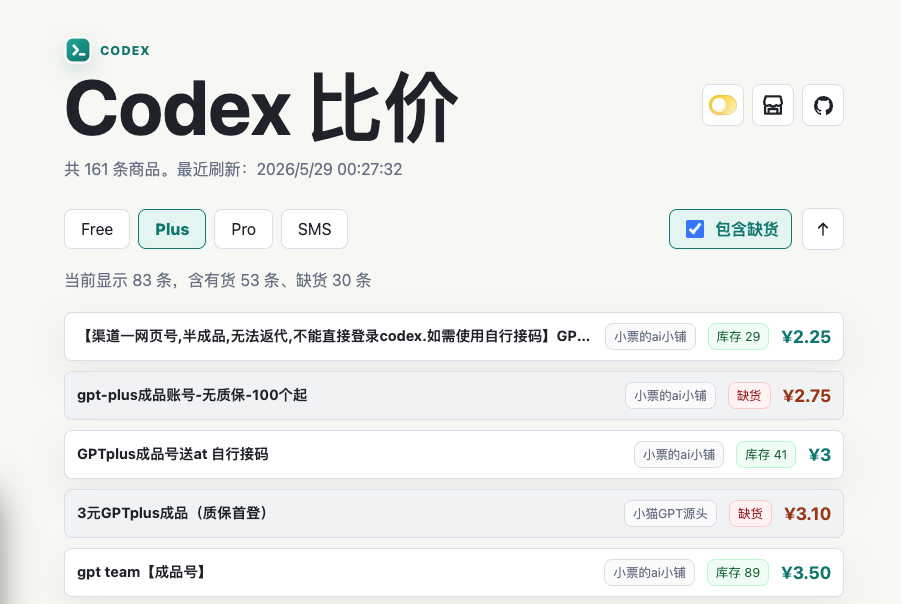

# Codex 比价

一个轻量的 Codex / ChatGPT 相关商品信息聚合与比价页面，用于汇总多个卡网店铺的公开商品信息，并按 Free、Plus、Pro、SMS 等分类展示价格、库存和店铺来源。

> 本站仅汇总公开商品信息供参考，不代表对任何店铺或商品质量作出背书。

在线体验：https://codex.jiuge.space

## 页面预览



主页面默认聚焦 Plus 商品，并在同一列表中展示商品标题、来源店铺、库存状态和价格。顶部可快速切换 Free、Plus、Pro、SMS 分类，也可以开启“包含缺货”来对比当前公开商品的完整供给情况。

## 项目特性

- 汇总多个卡网店铺的公开商品数据，统一展示商品标题、价格、库存和来源店铺。
- 按 Free、Plus、Pro、SMS 等分类筛选 Codex / ChatGPT 相关商品。
- 默认聚焦 Plus 商品，支持一键切换分类或再次点击清空当前分类。
- 支持价格升序 / 降序排序，并可选择是否包含缺货商品。
- 商品列表采用紧凑单行布局，便于快速比较不同店铺的库存与价格。
- 点击筛选、排序或显示设置时，商品列表提供轻量动态反馈。
- 支持黑色 / 淡色系切换，并记住本地选择。
- 店铺列表页可查看当前配置的全部店铺入口。
- 后台管理页可查看各店铺 `unknown` 商品，辅助维护分类规则。
- 后台支持查看下一次刷新时间、设置自动刷新间隔、手动触发刷新。
- 自动刷新商品数据，并将生成结果写入本地 JSON 文件；服务端刷新日志带 `GMT+8` 时间戳。
- 无数据库、无构建步骤，使用 Node.js 原生能力即可运行。

## 页面说明

### 主页面

默认端口：

```text
http://127.0.0.1:49173/
```

主页面展示商品列表，包含：

- 一级按钮：`全部`、`Codex`、`仅Plus`、`接码`
- 二级勾选：`free`、`plus`、`pro`、`接码`
- 排序：价格从低到高 / 价格从高到低
- 包含缺货开关
- 黑色 / 淡色系切换
- 店铺列表入口
- GitHub 项目主页入口

一级按钮和“仅Plus”按钮支持再次点击清空当前分类选择。商品卡片右侧展示库存与价格，筛选变化时会以轻量动画更新列表。

### 店铺列表

```text
http://127.0.0.1:49173/sources.html
```

店铺列表页读取 `data/sources.json`，展示当前配置的店铺名称、链接和 adapter 类型。

页面右侧提供“返回”入口，按钮风格与主页面工具按钮保持一致。

### 后台管理

默认端口：

```text
http://127.0.0.1:49174/
```

后台管理页用于：

- 查看当前自动刷新间隔。
- 查看下一次刷新时间。
- 修改刷新间隔。
- 手动刷新商品数据。
- 按店铺查看 `unknown` 商品列表，辅助维护分类规则。

## 快速开始

### 环境要求

- Node.js 18 或更高版本。
- 不需要数据库。
- 不需要前端构建工具。

### 安装与运行

```bash
npm install
npm start
```

启动后访问：

```text
http://127.0.0.1:49173/
```

后台管理页：

```text
http://127.0.0.1:49174/
```

### 手动刷新数据

```bash
npm run refresh
```

刷新后会生成：

- `data/products.json`
- `data/meta.json`

### 运行测试

```bash
npm test
```

## 数据文件

### `data/sources.json`

店铺数据源配置。每个店铺包含：

- `id`：店铺唯一标识。
- `name`：展示名称。
- `adapter`：采集适配器类型。
- `enabled`：是否启用。
- `url`：店铺地址。
- `token`：部分店铺平台需要的店铺 token。
- `apiBase`：部分前后端分离站点使用独立 API 域名时填写。

当前支持的 adapter：

- `ldxp`：链动小铺 / 同类接口。
- `acg`：ACG 类商品接口。
- `dujiao`：独角数卡 / 同类公开商品接口。

### ldxp / 链动小铺刷新策略

`ldxp` 类型站点默认使用 Playwright 浏览器上下文采集，复用 `.playwright-ldxp-profile/` 中的 cookie 和验证状态。首次遇到 WAF / 真人验证时，可以用有头模式打开页面手动处理：

```bash
LDXP_PLAYWRIGHT_HEADLESS=0 LDXP_PLAYWRIGHT_MANUAL_WAIT_MS=120000 npm run refresh
```

刷新顺序为：本机 Playwright、VPS Playwright、Windows Tailscale 探测。VPS 需要远端有同一份项目和依赖，默认路径为 `/root/codex-price-compare`，可用 `LDXP_PLAYWRIGHT_REMOTE_CWD` 覆盖；Windows 节点通过 `LDXP_WINDOWS_TAILSCALE_IP` 配置，当前仅做在线探测，未配置远程执行通道时会跳过。

常用环境变量：

- `LDXP_PLAYWRIGHT_HEADLESS=0`：有头模式，方便手动验证。
- `LDXP_PLAYWRIGHT_MANUAL_WAIT_MS=120000`：打开页面后等待 120 秒，让用户手动点击验证。
- `LDXP_PLAYWRIGHT_PROFILE=.playwright-ldxp-profile`：指定本机持久化浏览器 profile。
- `LDXP_PLAYWRIGHT_VPS_HOST=vps`：本机失败后通过 SSH 到 VPS 运行 Playwright。
- `LDXP_PLAYWRIGHT_REMOTE_CWD=/root/codex-price-compare`：VPS 上的项目目录。
- `LDXP_WINDOWS_TAILSCALE_IP=100.127.136.64`：最后探测 Windows 节点是否在线。

刷新前会自动备份 `data/products.json` 和 `data/meta.json` 到 `data/backups/`。如果检测到 WAF、HTTP 5xx/403/429、大面积失败或商品数量骤降，会保留旧 `products.json`，只更新 `meta.json` 并写入 `data/refresh-cooldown.json` 进入冷却。

### `data/rules.json`

商品分类规则配置。主要包含：

- `anchorTerms`：识别 Codex / ChatGPT / GPT 相关商品的锚点词。
- `smsServiceTerms`：识别接码服务的关键词。
- `accountStateTerms`：识别账号状态的关键词，例如“已接码”“接过码”。
- `subtypeTerms`：识别 `free`、`plus`、`pro`、`api` 等二级分类的关键词。

分类逻辑会优先根据商品标题识别明确的 `free`、`plus`、`pro` 套餐词，减少接码语境造成的误判。商品详情主要用于补充 Codex / GPT 相关性。

### `data/products.json`

刷新脚本生成的商品列表文件。主页面直接读取该文件展示商品。

### `data/meta.json`

刷新脚本生成的元信息，包含：

- 最近刷新时间。
- 下一次刷新时间。
- 数据源数量。
- 成功 / 失败数量。
- 商品数量。
- 错误信息。

### `data/refresh-settings.json`

后台刷新设置，当前包含自动刷新间隔：

```json
{
  "intervalMs": 1800000
}
```

## 自动刷新

运行 `npm start` 后，服务端会：

1. 读取 `data/refresh-settings.json` 中的刷新间隔。
2. 启动后短暂延迟触发一次刷新。
3. 按设定间隔持续刷新商品数据。
4. 将下一次刷新时间写入 `data/meta.json`。
5. 在终端输出带 `GMT+8` 时间戳的刷新日志，方便核对自动刷新时间。

后台页面提供：

- 查看刷新状态：`GET /api/refresh`
- 手动刷新：`POST /api/refresh`
- 修改刷新间隔：`POST /api/refresh-settings`

主页面和后台页面也会定时重新读取本地 JSON 数据，因此自动刷新完成后，页面会在下一轮前端轮询时更新。

## 项目结构

```text
.
├── admin.html              # 后台管理页面
├── admin.js                # 后台管理逻辑
├── app.js                  # 主页面逻辑
├── assets/logo.svg         # 站点图标
├── data/
│   ├── rules.json          # 分类规则
│   ├── sources.json        # 店铺数据源
│   ├── meta.json           # 运行时生成，已忽略
│   ├── products.json       # 运行时生成，已忽略
│   └── refresh-settings.json # 运行时生成，已忽略
├── index.html              # 主页面
├── scripts/refresh-products.mjs
├── server.mjs              # 本地 HTTP 服务与刷新 API
├── sources.html            # 店铺列表页面
├── sources.js              # 店铺列表逻辑
├── src/
│   ├── cleaning.mjs        # 数据清洗与分类
│   └── refresh.mjs         # 商品刷新核心逻辑
├── styles.css              # 全站样式
└── tests/site.test.mjs     # 基础回归测试
```

## 添加新店铺

手动编辑 `data/sources.json`，新增一个 source，例如：

```json
{
  "id": "example-shop",
  "name": "示例店铺",
  "adapter": "ldxp",
  "enabled": true,
  "url": "https://example.com/shop/token",
  "token": "token"
}
```

如果店铺平台已有相同公开接口，只需要选择对应 adapter。若页面必须通过浏览器点击、登录或复杂前端交互才能读取商品，则需要新增 adapter 或引入浏览器自动化采集逻辑。

也可以让 Codex 维护数据源：在浏览器书签中把候选卡网统一放进名为“卡网”的书签文件夹，然后提示 Codex 阅读本项目的 `AGENTS.md` / 项目说明，检查书签中的卡网站点，识别可用 adapter，并自动维护 `data/sources.json`。书签文件夹名称需要保持统一为“卡网”，否则自动识别时可能漏掉站点。

## 调整分类规则

如果后台出现 `unknown` 商品，可优先修改 `data/rules.json`：

- 商品明显是 Free：加入 `subtypeTerms.free`
- 商品明显是 Plus：加入 `subtypeTerms.plus`
- 商品明显是 Pro：加入 `subtypeTerms.pro`
- 商品是接码服务：加入 `smsServiceTerms`

修改后运行：

```bash
npm run refresh
npm test
```

## 注意事项

- 本项目读取的是公开商品信息，不处理交易、不托管商品、不提供担保。
- 商品价格、库存、标题和状态以原店铺为准。
- 分类规则是基于关键词的启发式判断，可能需要随数据源变化持续维护。
- 自动刷新频率不宜过高，避免对来源站点造成不必要压力。
- 当前 GitHub 链接指向项目仓库：https://github.com/GHSaiMo/codex-price-compare

## 免责声明

本站仅汇总公开商品信息供参考，不代表对任何店铺或商品质量作出背书。用户应自行判断商品来源、售后承诺、履约风险与合规风险。

## License

本项目基于 MIT License 开源，详见 [LICENSE](LICENSE)。
