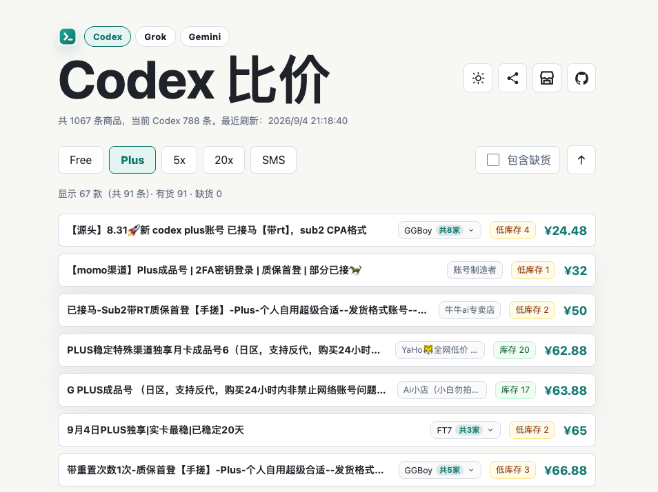
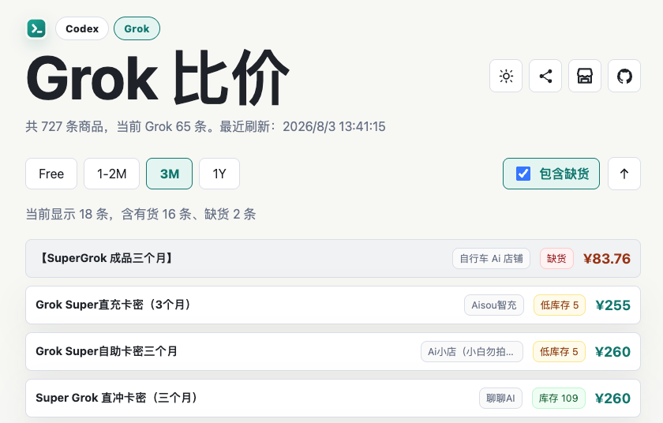

# Codex 比价

一个轻量的 Codex / ChatGPT、Grok 与 Gemini 相关商品信息聚合与比价页面，用于汇总多个卡网店铺的公开商品信息。首页支持 Codex / Grok / Gemini 三模式切换：Codex 按 Free、Plus、5x、20x、SMS 分类，Grok 按 Free、1M、3M、1Y 分类，Gemini 按 1Y、18M、Others 分类，展示价格、库存和店铺来源。

> 本站仅汇总公开商品信息供参考，不代表对任何店铺或商品质量作出背书。

在线体验：https://codex.jiuge.space

## 页面预览





主页面支持 Codex / Grok / Gemini 模式切换。Codex 模式默认聚焦 Plus 商品，并提供 Free、Plus、5x、20x、SMS 分类；Grok 模式默认聚焦 1M，并提供 Free、1M、3M、1Y 分类；Gemini 模式默认聚焦 18M，并提供 1Y、18M、Others 分类。同一列表展示商品标题、来源店铺、库存状态和价格，也可搜索标题、按店铺筛选，或开启“包含缺货”对比完整供给。

## 项目特性

- 汇总多个卡网店铺的公开商品数据，统一展示商品标题、价格、库存和来源店铺。
- 首页支持 Codex / Grok / Gemini 三模式切换，店铺列表与商品采集链路共享。
- Codex 按 Free、Plus、5x、20x、SMS 分类筛选；Grok 按 Free、1M、3M、1Y 分类筛选；Gemini 按 1Y、18M、Others 分类筛选。
- Codex 默认聚焦 Plus（含缺货），Grok 默认聚焦 1M，Gemini 默认聚焦 18M。
- 支持标题搜索、店铺筛选、价格升序 / 降序排序，并可选择是否包含缺货商品。
- 商品列表采用紧凑单行布局，便于快速比较不同店铺的库存与价格。
- 点击筛选、排序或显示设置时，商品列表提供轻量动态反馈。
- 支持黑色 / 淡色系切换，并记住本地选择。
- 店铺列表页可查看当前配置的全部店铺入口。
- 后台管理页可查看各店铺 `unknown` 商品、源健康（跳过 / 冷却 / 失败 / 停用）和观察商品的价格走势。
- 后台观察区只在商品消失、补货或跌破到价阈值时推送微信，并可选择每日摘要。
- 后台支持查看下一次刷新时间、设置自动刷新间隔、手动触发刷新。
- 自动刷新商品数据，并将生成结果写入本地 JSON 文件；服务端刷新日志带 `GMT+8` 时间戳。
- 无数据库、无构建步骤，使用 Node.js 原生能力即可运行。

## 页面说明

### 主页面

默认端口：

```text
http://127.0.0.1:49173/
```

主页面展示商品列表，包含：

- 模式切换：`Codex` / `Grok` / `Gemini`
- Codex 分类：`Free`、`Plus`、`5x`、`20x`、`SMS`
- Grok 分类：`Free`、`1M`、`3M`、`1Y`
- Gemini 分类：`1Y`、`18M`（默认）、`Others`
- 搜索标题或店铺，并按店铺筛选
- 排序：价格从低到高 / 价格从高到低
- 包含缺货开关
- 黑色 / 淡色系切换
- 店铺列表入口
- GitHub 项目主页入口

商品卡片右侧展示库存与价格；数据超过两小时会标出年龄。筛选变化时会以轻量动画更新列表。

### 店铺列表

```text
http://127.0.0.1:49173/sources.html
```

店铺列表页读取 `data/sources.json`，展示当前配置的店铺名称、链接和 adapter 类型。

页面右侧提供“返回”入口，按钮风格与主页面工具按钮保持一致。

### 后台管理

默认端口：

```text
http://127.0.0.1:49174/
```

后台管理页用于：

- 查看当前自动刷新间隔。
- 查看下一次刷新时间。
- 修改刷新间隔。
- 手动刷新商品数据。
- 按店铺查看 `unknown` 商品、源健康和长期失败后自动停用的店铺。
- 观察商品的到价 / 补货 / 消失通知，以及 14 日价格走势。

## 快速开始

### 环境要求

- Node.js 18 或更高版本。
- 不需要数据库。
- 不需要前端构建工具。

### 安装与运行

```bash
npm install
npm start
```

启动后访问：

```text
http://127.0.0.1:49173/
```

后台管理页：

```text
http://127.0.0.1:49174/
```

### 手动刷新数据

```bash
npm run refresh
```

刷新后会生成：

- `data/products.json`
- `data/meta.json`
- `data/price-history.json`（观察商品的价格 / 库存序列，不入库）

### 运行测试

```bash
npm test
```

## 数据文件

### `data/sources.json`

店铺数据源配置。每个店铺包含：

- `id`：店铺唯一标识。
- `name`：展示名称。
- `adapter`：采集适配器类型。
- `enabled`：是否启用。
- `url`：店铺地址。
- `token`：部分店铺平台需要的店铺 token。
- `apiBase`：部分前后端分离站点使用独立 API 域名时填写。

当前支持的 adapter：

- `ldxp`：链动小铺 / 同类接口。
- `acg`：ACG 类商品接口。
- `dujiao`：独角数卡 / 同类公开商品接口。

### ldxp / 链动小铺刷新策略

`ldxp` 类型站点默认使用专用调度策略：每轮最多刷新 15 家，核心店铺优先，非核心店铺按游标轮转；同一轮的 ldxp 店铺之间随机等待 8-25 秒；同域名触发 WAF / 非 JSON / 403 / 429 后会进入 6 小时冷却。未排到、冷却中或单店失败时，会保留该店铺上一次成功采集的旧商品，不会用空结果覆盖。

默认采集模式为 Playwright 浏览器上下文，复用 `.playwright-ldxp-profile/` 中的 cookie 和验证状态。首次遇到 WAF / 真人验证时，可以用有头模式打开页面手动处理：

```bash
LDXP_PLAYWRIGHT_HEADLESS=0 LDXP_PLAYWRIGHT_MANUAL_WAIT_MS=120000 npm run refresh
```

刷新顺序为：本机 Playwright、VPS Playwright、Windows Tailscale 探测。VPS 需要远端有同一份项目和依赖，默认路径为 `/root/codex-price-compare`，可用 `LDXP_PLAYWRIGHT_REMOTE_CWD` 覆盖；Windows 节点通过 `LDXP_WINDOWS_TAILSCALE_IP` 配置，当前仅做在线探测，未配置远程执行通道时会跳过。本项目当前不建议使用多 VPS / 代理池分流绕过 WAF，优先通过低频、冷却和旧数据保留保证长期稳定。

常用环境变量：

- 配置入口：项目根目录 `.env`。可以参考 `.env.example`，刷新脚本和服务启动时会自动读取；命令行临时传入的环境变量优先级更高。
- `LDXP_PLAYWRIGHT_HEADLESS=0`：有头模式，方便手动验证。
- `LDXP_PLAYWRIGHT_MANUAL_WAIT_MS=120000`：打开页面后等待 120 秒，让用户手动点击验证。
- `LDXP_PLAYWRIGHT_PROFILE=.playwright-ldxp-profile`：指定本机持久化浏览器 profile。
- `LDXP_FETCH_MODE=playwright`：默认模式，使用浏览器上下文采集。
- `LDXP_FETCH_MODE=fetch`：直接请求 ldxp 接口，不打开浏览器；用于测试直连接口是否可用，仍遵守 15 家上限、6 小时冷却、8-25 秒随机间隔和旧数据保留策略。
- `LDXP_MAX_SOURCES_PER_RUN=15`：每轮最多刷新的 ldxp 店铺数。
- `LDXP_DOMAIN_COOLDOWN_HOURS=6`：同域名触发 WAF 后的冷却小时数。
- `LDXP_DELAY_MIN_MS=8000` / `LDXP_DELAY_MAX_MS=25000`：ldxp 店铺之间的随机等待区间。
- `DISABLED_SOURCE_PROBE_HOURS=24`：停用店铺的自动健康探测间隔（小时）。默认每 24 小时对处于停用状态的店铺进行一次轻量级健康检测，若目标站点恢复（HTTP 200 且数据正常）则自动解除停用自愈。
- `FALLBACK_PROXY_URL=http://127.0.0.1:7890`：直连请求失败时，通过本机代理回退；直连成功时不会使用代理。
- `FALLBACK_PROXY_REQUEST_ATTEMPTS=3`：代理请求发生连接、TLS 或命令执行失败时的总尝试次数。
- `FALLBACK_PROXY_RETRY_DELAY_MS=1000`：代理重试的基础间隔，默认按 1 秒、2 秒递增等待。
- `LDXP_PLAYWRIGHT_VPS_HOST=vps`：本机失败后通过 SSH 到 VPS 运行 Playwright。
- `LDXP_PLAYWRIGHT_REMOTE_CWD=/root/codex-price-compare`：VPS 上的项目目录。
- `LDXP_WINDOWS_TAILSCALE_IP=100.127.136.64`：最后探测 Windows 节点是否在线。

后台管理页会在 ldxp 店铺右侧显示“核心”勾选。勾选后会在 `data/sources.json` 中写入 `core: true`。核心店铺采用隔轮轮休机制（如 4 个核心每轮抓 2 个，5 个核心交替抓 3 个与 2 个），每两轮完整覆盖一次，避免同一域名密集请求触发风控；非核心店铺动态分配当轮剩余名额（总配额减去当轮核心数），按游标轮转抓取。

刷新前会自动备份 `data/products.json` 和 `data/meta.json` 到 `data/backups/`。全局检测到 WAF、HTTP 5xx/403/429、大面积失败或商品数量骤降时，会保留旧 `products.json`，只更新 `meta.json` 并写入 `data/refresh-cooldown.json` 进入全局冷却；ldxp 域名级冷却状态单独保存在 `data/ldxp-scheduler.json`。

### `data/rules.json`

商品分类规则配置。主要包含：

- `anchorTerms`：识别 Codex / ChatGPT / GPT 相关商品的锚点词。
- `grokAnchorTerms`：识别 Grok / xAI 相关商品的锚点词。
- `grokDurationTerms`：识别 Grok Free / `m1`（1M）/ `m3` / `y1`（1Y）的关键词。
- `grokExclusionTerms`：排除 X Premium、GPT 混充等非 Grok 商品。
- `geminiAnchorTerms`：识别 Gemini / Google AI / 双子座相关商品的锚点词。
- `geminiDurationTerms`：识别 Gemini `y1`（1Y）/ `m18`（18M）的关键词。
- `geminiExclusionTerms`：排除 Leonardo 绘图等非 Gemini 商品。
- `smsServiceTerms`：识别接码服务的关键词。
- `accountStateTerms`：识别账号状态的关键词，例如“已接码”“接过码”。
- `subtypeTerms`：识别 Codex 的 `free`、`plus`、`pro`、`api` 等二级分类关键词。
- `titleExclusionTerms` / `exclusionTerms`：排除 kiro、中转 API、官方中转、镜像站、邀请额度/邀请资格、Gmail/谷歌接码邮箱等明显无关或第三方商品。

分类逻辑会优先根据标题锚点判断品牌归属（Grok / Gemini / Codex）。命中 Grok 后归入 Free / 1M / 3M / 1Y；命中 Gemini 后根据时长归入 1Y / 18M，其他非 1Y/18M 规格（如 3M、1M、体验号等）归入 Others。Codex 路径会优先根据商品标题识别明确的 `free`、`plus`、`pro` 套餐词；若标题同时出现“长效接码 / 质保不来码 / PLUS接码”等接码服务强信号，则仍归入 SMS，避免把接码服务误判成套餐账号。邀请额度、邀请资格这类商品会直接排除。

### `data/products.json`

刷新脚本生成的商品列表文件。主页面直接读取该文件展示商品。

### `data/meta.json`

刷新脚本生成的元信息，包含：

- 最近刷新时间。
- 下一次刷新时间。
- 数据源数量。
- 成功 / 失败数量。
- 商品数量。
- 错误信息。

### `data/refresh-settings.json`

后台刷新设置，当前包含自动刷新间隔：

```json
{
  "intervalMs": 1800000
}
```

## 自动刷新

运行 `npm start` 后，服务端会：

1. 读取 `data/refresh-settings.json` 中的刷新间隔。
2. 启动后短暂延迟触发一次刷新。
3. 按设定间隔持续刷新商品数据。
4. 将下一次刷新时间写入 `data/meta.json`。
5. 在终端输出带 `GMT+8` 时间戳的刷新日志，方便核对自动刷新时间。

后台页面提供：

- 查看刷新状态：`GET /api/refresh`
- 手动刷新：`POST /api/refresh`
- 修改刷新间隔：`POST /api/refresh-settings`

主页面和后台页面也会定时重新读取本地 JSON 数据，因此自动刷新完成后，页面会在下一轮前端轮询时更新。

## 价格与库存通知

观察区商品发生价格或库存变化时，服务会通过本机 WeChatBridge 发送通知，默认接口为 `http://127.0.0.1:5033/`。通知对象需在 `.env` 中通过 `WECHATBRIDGE_TARGET` 配置：

```dotenv
STOCK_NOTIFY_ENABLED=1
WECHATBRIDGE_URL=http://127.0.0.1:5033/
WECHATBRIDGE_TARGET=your_contact_name
```

后台观察区的“测试通知”使用同一条 WeChatBridge 发送链路。发送前需确保 WeChatBridge 已在本机运行并能访问目标联系人。

## 项目结构

```text
.
├── admin.html              # 后台管理页面
├── admin.js                # 后台管理逻辑
├── app.js                  # 主页面逻辑
├── assets/
│   ├── logo.svg            # 站点图标
│   ├── codex-price-compare-home.png  # Codex 模式预览图
│   └── grok-price-compare-home.png   # Grok 模式预览图
├── data/
│   ├── rules.json          # 分类规则
│   ├── sources.json        # 店铺数据源
│   ├── meta.json           # 运行时生成，已忽略
│   ├── products.json       # 运行时生成，已忽略
│   └── refresh-settings.json # 运行时生成，已忽略
├── index.html              # 主页面
├── scripts/refresh-products.mjs
├── server.mjs              # 本地 HTTP 服务与刷新 API
├── source-sort.js          # 店铺排序共用逻辑
├── sources.html            # 店铺列表页面
├── sources.js              # 店铺列表逻辑
├── src/
│   ├── cleaning.mjs        # 数据清洗与分类
│   ├── price-history.mjs   # 观察商品价格 / 库存序列
│   └── refresh.mjs         # 商品刷新核心逻辑
├── styles.css              # 全站样式
└── tests/
    ├── classify.test.mjs   # 分类规则金样
    ├── refresh.test.mjs    # 刷新、死店停用、价格历史
    ├── site.test.mjs       # 页面行为回归
    └── stock-watch.test.mjs # 观察区通知
```

## 添加新店铺

手动编辑 `data/sources.json`，新增一个 source，例如：

```json
{
  "id": "example-shop",
  "name": "示例店铺",
  "adapter": "ldxp",
  "enabled": true,
  "url": "https://example.com/shop/token",
  "token": "token"
}
```

如果店铺平台已有相同公开接口，只需要选择对应 adapter。若页面必须通过浏览器点击、登录或复杂前端交互才能读取商品，则需要新增 adapter 或引入浏览器自动化采集逻辑。

也可以让 Codex 维护数据源：在浏览器书签中把候选卡网统一放进名为“卡网”的书签文件夹，然后提示 Codex 阅读本项目的 `AGENTS.md` / 项目说明，检查书签中的卡网站点，识别可用 adapter，并自动维护 `data/sources.json`。书签文件夹名称需要保持统一为“卡网”，否则自动识别时可能漏掉站点。

## 调整分类规则

如果后台出现 `unknown` 商品，可优先修改 `data/rules.json`：

- 商品明显是 Free：加入 `subtypeTerms.free`
- 商品明显是 Plus：加入 `subtypeTerms.plus`
- 商品明显是 Pro：加入 `subtypeTerms.pro`
- 商品是接码服务：加入 `smsServiceTerms`

修改后运行：

```bash
npm run refresh
npm test
```

## 注意事项

- 本项目读取的是公开商品信息，不处理交易、不托管商品、不提供担保。
- 商品价格、库存、标题和状态以原店铺为准。
- 分类规则是基于关键词的启发式判断，可能需要随数据源变化持续维护。
- 自动刷新频率不宜过高，避免对来源站点造成不必要压力。
- 当前 GitHub 链接指向项目仓库：https://github.com/GHSaiMo/codex-price-compare

## 免责声明

本站仅汇总公开商品信息供参考，不代表对任何店铺或商品质量作出背书。用户应自行判断商品来源、售后承诺、履约风险与合规风险。

## License

本项目基于 MIT License 开源，详见 [LICENSE](LICENSE)。
